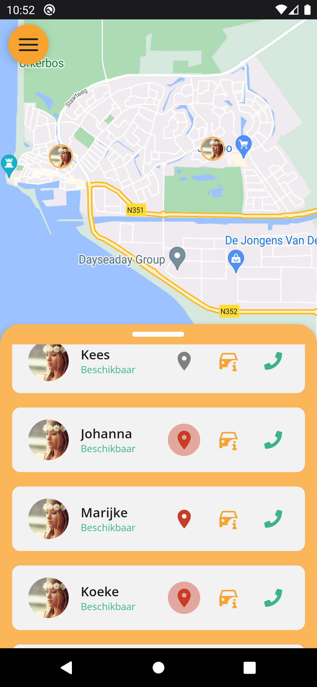
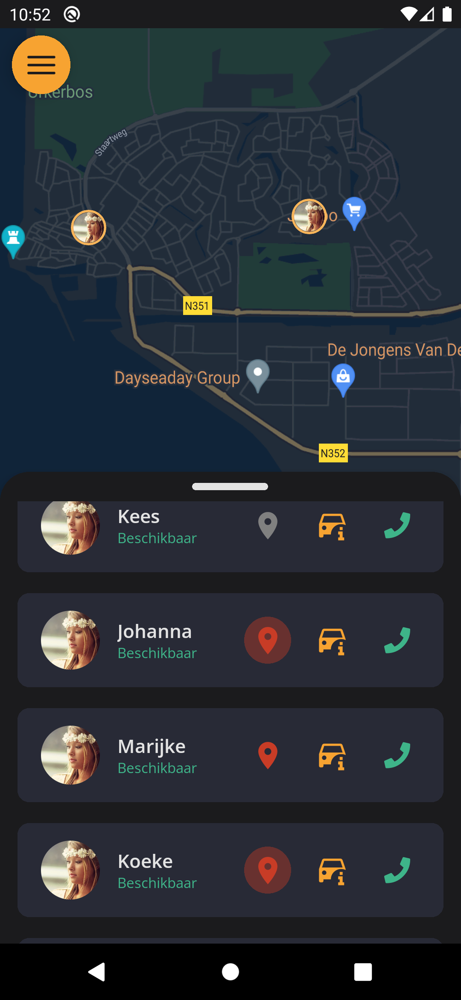
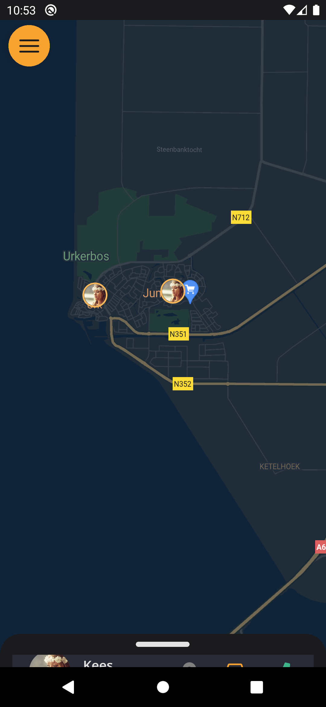
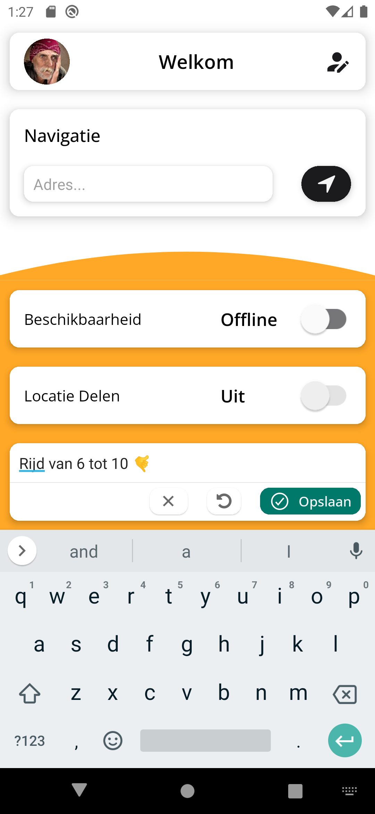
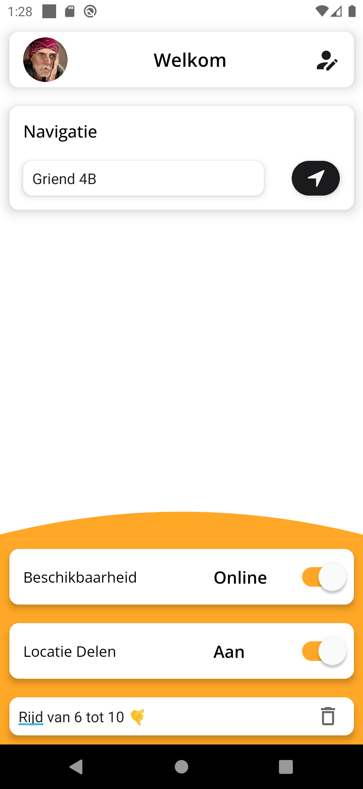
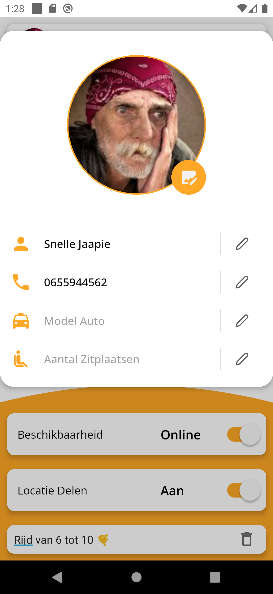

# Taxi Urk
> Lokale Taxi app voor het zien welke taxi beschikbaar is en deze te bellen voor een afspraak.  
> Live expo demo [_hier_](https://expo.dev/@sjaakvanlenten/weatherApp).

## Table of Contents
* [Technologies Used](#technologies-used)
* [Screenshots](#screenshots)

## Technologies Used
- React Native Expo - version 49.0
- React Navigation - version 6
- TypeScript - version 5.1
- React Hook Form - version 7
- Firebase - version 9
- React Native Maps

## Screenshots
Client:

Taxi Driver:

